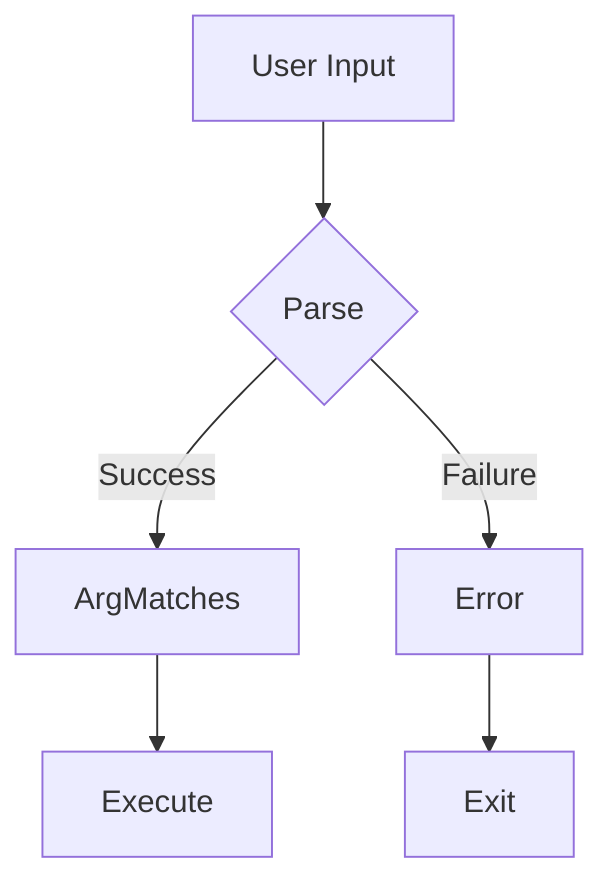

# Visual Guide and Diagram Standards

> Style guide for ASCII diagrams and visual content in the Clap Architecture Book

This document establishes standards for creating consistent, accessible, and effective visual content throughout the book.

---

## ASCII Art Legend

### Box Drawing Characters

Use consistent box-drawing characters for all diagrams:

```
SINGLE-LINE BOXES (for standard content):
+---+   Top-left corner:     +
|   |   Top-right corner:    +
+---+   Bottom-left corner:  +
        Bottom-right corner: +
        Horizontal line:     -
        Vertical line:       |

DOUBLE-LINE BOXES (for emphasis/headers):
+===+   Use = for emphasized horizontal lines
|   |   Keep | for vertical lines
+===+

ROUNDED CORNERS (use sparingly):
.---.   Period for softer top corners
|   |
'---'   Apostrophe for softer bottom corners
```

### Arrow Styles

```
FLOW ARROWS (direction of data/control):
    |
    v     Downward flow (most common)

    ^
    |     Upward flow

 -->      Right flow (left-to-right reading)

 <--      Left flow (return/feedback)

BRANCHING ARROWS:
    |
    +---> Branch to multiple destinations
    |
    +--->

DECISION ARROWS:
    |
    YES  NO
    +-+ +-+
    |     |
    v     v
```

### Section Separators

```
MAJOR SECTION (top-level division):
+===========================================================================+
|                         SECTION TITLE                                      |
+===========================================================================+

SUBSECTION:
+------------------------------------------------------------------+
|   Subsection Title                                                |
+------------------------------------------------------------------+

INLINE SEPARATION:
    ================================
```

---

## Diagram Types and When to Use Them

### Architecture Diagrams

**Use for**: System structure, component relationships, high-level overviews

**Pattern**:
```
+===========================================================================+
|                    ARCHITECTURE DIAGRAM TITLE                              |
+===========================================================================+

    +------------------+         +------------------+
    |   Component A    |-------->|   Component B    |
    |                  |         |                  |
    |  - Feature 1     |         |  - Feature X     |
    |  - Feature 2     |         |  - Feature Y     |
    +------------------+         +------------------+
            |                            |
            v                            v
    +------------------+         +------------------+
    |   Component C    |         |   Component D    |
    +------------------+         +------------------+
```

**Best practices**:
- Keep components evenly spaced
- Use consistent box widths within a diagram
- Label connections when purpose is not obvious
- Include a legend if using special symbols

### Flow Diagrams

**Use for**: Processes, algorithms, decision trees, data flow

**Pattern**:
```
    START
      |
      v
+-------------+
| Step 1      |
+-------------+
      |
      v
+-------------+
| Decision?   |------YES---->+-------------+
+-------------+              | Path A      |
      |                      +-------------+
      NO                           |
      |                            v
      v                      +-------------+
+-------------+              | End A       |
| Path B      |              +-------------+
+-------------+
      |
      v
+-------------+
| End B       |
+-------------+
```

**Best practices**:
- Use diamond shapes (implied by labels) for decisions
- Keep YES on the right, NO going down when possible
- Align elements on a grid
- Show start and end points clearly

### Hierarchy Diagrams

**Use for**: Class structures, command trees, inheritance

**Pattern**:
```
                        Root
                          |
            +-------------+-------------+
            |             |             |
            v             v             v
        +-------+     +-------+     +-------+
        | Child1|     | Child2|     | Child3|
        +-------+     +-------+     +-------+
            |
        +---+---+
        |       |
        v       v
    +-----+ +-----+
    |Leaf1| |Leaf2|
    +-----+ +-----+
```

**Best practices**:
- Keep siblings aligned horizontally
- Use consistent spacing between levels
- Limit depth to 4-5 levels for readability

### Comparison Tables

**Use for**: Feature comparisons, option matrices, quick references

**Pattern**:
```
+------------------+---------------+---------------+
| Feature          | Option A      | Option B      |
+------------------+---------------+---------------+
| Speed            | Fast          | Slow          |
+------------------+---------------+---------------+
| Memory           | Low           | High          |
+------------------+---------------+---------------+
| Complexity       | Simple        | Complex       |
+------------------+---------------+---------------+
```

**Best practices**:
- Use consistent column widths
- Align text left within cells
- Keep rows to a reasonable width (< 70 chars)

### Timeline/Sequence Diagrams

**Use for**: Evolution, history, step sequences

**Pattern**:
```
    2020 ------+------ Event A
               |
    2021 ------+------ Event B
               |
    2022 ------+------ Event C
               |
    2023 ------+------ Event D
               |
    Now -------+
```

**Best practices**:
- Keep timeline vertical for markdown readability
- Use consistent date/step formatting
- Add brief descriptions beside events

---

## Sizing and Spacing Guidelines

### Maximum Width

```
STANDARD WIDTH: 75 characters
+-------------------------------------------------------------------------+
|  This is the standard maximum width for diagrams in the book.           |
|  It fits well on most screens and prints correctly.                     |
+-------------------------------------------------------------------------+

NARROW WIDTH: 50 characters (for side-by-side or nested content)
+------------------------------------------------+
|  Use for embedded diagrams or comparisons.     |
+------------------------------------------------+

WIDE WIDTH: 90 characters (use sparingly)
+-----------------------------------------------------------------------------------------+
|  Only for complex diagrams that absolutely require extra width.                          |
|  May not display well on mobile or in narrow windows.                                    |
+-----------------------------------------------------------------------------------------+
```

### Vertical Spacing

```
Between major sections:     3 blank lines


Between subsections:        2 blank lines


Between related elements:   1 blank line

Inside boxes:               No extra lines (keep content tight)
```

### Indentation

```
Standard indent:    4 spaces
Nested content:     4 spaces per level

    Level 1
        Level 2
            Level 3
                Level 4 (maximum recommended depth)
```

---

## Color Scheme Compatibility

Since ASCII diagrams are rendered in both light and dark themes, ensure readability in both:

### Characters That Work in All Themes

```
SAFE CHARACTERS:
+ - | = _ / \ < > ^ v
[ ] ( ) { }
# * @ $ %
: ; . ,
```

### Avoid These Patterns

```
PROBLEMATIC:
- Very light characters (.,:) as primary structure
- Mixing too many character types in one diagram
- Unicode box-drawing characters (may not render consistently)
```

---

## Accessibility Considerations

### Diagram Descriptions

Always include a text description after complex diagrams:

```
+------------------+
|                  |
|    [Diagram]     |
|                  |
+------------------+

**Diagram Description**: This diagram shows [describe the key elements
and relationships in plain prose]. The main takeaway is [key insight].
```

### Alternative Text Patterns

For screenreader users, descriptions should:

1. State what the diagram type is
2. Describe the main elements (top to bottom, left to right)
3. Explain key relationships
4. Summarize the insight or purpose

Example:
```
**Diagram Description**: This flowchart shows the parsing pipeline
in four stages. User input flows into Stage 1 (Tokenization), then
to Stage 2 (Matching), Stage 3 (Validation), and finally Stage 4
(Result Construction). Each stage can produce errors that exit the
flow early.
```

---

## Naming Conventions

### Diagram Files

```
diagrams/
+-- references/
|   +-- architecture-overview.md      # System architecture
|   +-- parsing-pipeline.md           # Value parsing flow
|   +-- error-recovery.md             # Error handling
|   +-- command-lifecycle.md          # Execution flow
|   +-- config-precedence.md          # Config layering
|   +-- testing-strategy.md           # Test approaches
|
+-- visual-guide.md                   # This file
```

Naming pattern: `<topic>-<type>.md`
- Use kebab-case (lowercase with hyphens)
- Keep names descriptive but concise
- Group related diagrams in subdirectories

### Inline Diagram Titles

```
GOOD:
+===========================================================================+
|                    VALUE PARSING PIPELINE                                  |
+===========================================================================+

BAD:
+===========================================================================+
|                    Diagram 3                                               |
+===========================================================================+
```

---

## Mermaid Diagram Syntax (Optional)

For mdbook with mermaid plugin enabled, you can use:

````

````

### When to Use Mermaid vs ASCII

| Use Case              | ASCII                | Mermaid              |
|-----------------------|----------------------|----------------------|
| Print/PDF output      | Yes (preferred)      | May not render       |
| GitHub preview        | Yes                  | Yes (if enabled)     |
| Terminal viewing      | Yes                  | No                   |
| Complex flows         | Tedious              | Preferred            |
| Quick inline diagrams | Preferred            | Overkill             |

**Recommendation**: Default to ASCII for book content. Use Mermaid only when ASCII becomes impractical (complex flowcharts with many branches).

---

## Diagram Templates

### Architecture Template

```
+===========================================================================+
|                    [TITLE - CAPS]                                          |
+===========================================================================+

    +-----------------+          +-----------------+
    |  [Component 1]  |--------->|  [Component 2]  |
    |                 |          |                 |
    |  - Item A       |          |  - Item X       |
    |  - Item B       |          |  - Item Y       |
    +-----------------+          +-----------------+

**Diagram Description**: [One to two sentences explaining the diagram]
```

### Flow Template

```
+===========================================================================+
|                    [PROCESS NAME]                                          |
+===========================================================================+

    Step/Input
        |
        v
    +-------------+
    | Action      |
    +-------------+
        |
        v
    +-------------+
    | Decision?   |
    +-------------+
        |
   +----+----+
   |         |
   v         v
 [A]       [B]

**Diagram Description**: [Description]
```

### Comparison Template

```
+===========================================================================+
|                    [COMPARISON TITLE]                                      |
+===========================================================================+

    +-----------------+          +-----------------+
    |   Option A      |          |   Option B      |
    +-----------------+          +-----------------+
    |                 |          |                 |
    | Pro: ...        |          | Pro: ...        |
    | Con: ...        |          | Con: ...        |
    |                 |          |                 |
    | Use when: ...   |          | Use when: ...   |
    +-----------------+          +-----------------+

**Diagram Description**: [Description]
```

---

## Quality Checklist

Before adding a diagram to the book, verify:

- [ ] Diagram has a clear title
- [ ] Consistent character usage throughout
- [ ] Proper alignment (use monospace font preview)
- [ ] Width is within 75 characters (or documented exception)
- [ ] Includes description paragraph below
- [ ] Renders correctly in both light and dark themes
- [ ] No broken lines or misaligned elements
- [ ] Cross-references to related chapters/diagrams included

---

## Cross-References

### Diagram Reference Files

- [Architecture Overview](./references/architecture-overview.md)
- [Parsing Pipeline](./references/parsing-pipeline.md)
- [Error Recovery](./references/error-recovery.md)
- [Command Lifecycle](./references/command-lifecycle.md)
- [Configuration Precedence](./references/config-precedence.md)
- [Testing Strategy](./references/testing-strategy.md)

### Related Chapters

- [Chapter 1: Philosophy](../part1-foundations/01-clap-philosophy.md) - Timeline diagrams
- [Chapter 4: Subcommands](../part1-foundations/04-subcommand-architecture.md) - Hierarchy diagrams
- [Chapter 5: Error Handling](../part1-foundations/05-error-handling-foundations.md) - Flow diagrams
- [Chapter 9: Value Parsing](../part2-core-patterns/09-value-parsing-validation.md) - Pipeline diagrams
- [Chapter 15: Testing](../part3-advanced-architecture/15-testing-cli-applications.md) - Strategy diagrams

---

*This style guide ensures visual consistency and accessibility across all diagrams in the Clap Architecture Book.*
