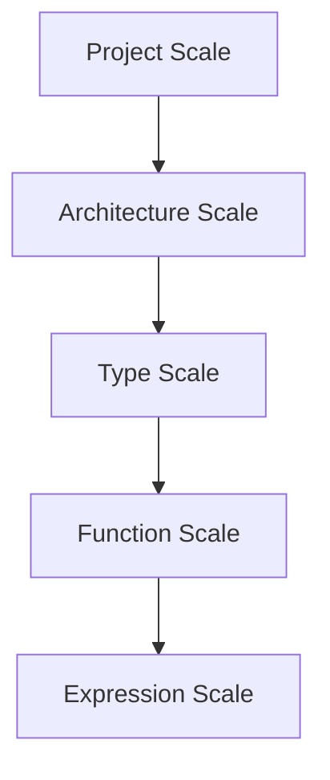

# Building the Rust Patterns Book

## Quick Start

```bash
# Install mdbook
cargo install mdbook

# Build HTML (default)
cd patterns-book
mdbook build

# Serve locally with hot reload
mdbook serve --open
```

---

## PDF Export

### Option 1: mdbook-pdf (Recommended)

Uses headless Chrome/Edge to render PDF from HTML.

```bash
# Install
cargo install mdbook-pdf

# Requirements (one of):
# - Windows 10+: Edge is built-in
# - macOS: Install Chrome or Edge
# - Linux: Install Chromium
sudo apt install chromium-browser  # Debian/Ubuntu
sudo dnf install chromium          # Fedora

# Build (PDF will be in book/pdf/)
mdbook build
```

**Configuration** (already in book.toml):
```toml
[output.pdf]
scale = 1
paper-width = 8.5
paper-height = 11
margin-top = 0.5
generate-document-outline = true
```

### Option 2: mdbook-pandoc (Higher Quality)

Uses Pandoc + LaTeX for professional typesetting.

```bash
# Install
cargo install mdbook-pandoc

# Requirements
sudo apt install pandoc texlive-xetex texlive-fonts-recommended

# Enable in book.toml (uncomment pandoc section)
# Build
mdbook build
```

---

## EPUB Export

```bash
# Install
cargo install mdbook-epub

# Enable in book.toml:
# [output.epub]
# cover-image = "cover.png"

# Build
mdbook build
```

---

## Extensions / Preprocessors

### Admonishments (Callouts)

```bash
cargo install mdbook-admonish
mdbook-admonish install patterns-book
```

Usage in markdown:
~~~markdown
```admonish warning
This pattern has tradeoffs!
```

```admonish tip title="Pro Tip"
Use this when...
```
~~~

### Mermaid Diagrams

```bash
cargo install mdbook-mermaid
mdbook-mermaid install patterns-book
```

Usage:
~~~markdown

~~~

### KaTeX Math

```bash
cargo install mdbook-katex
```

Usage:
```markdown
Inline math: $O(n \log n)$

Block math:
$$
\sum_{i=1}^{n} i = \frac{n(n+1)}{2}
$$
```

### Link Checking

```bash
cargo install mdbook-linkcheck
```

Automatically validates all links during build.

---

## All Extensions at Once

```bash
# Install everything
cargo install mdbook mdbook-pdf mdbook-admonish mdbook-mermaid mdbook-katex mdbook-linkcheck

# Initialize preprocessors
cd patterns-book
mdbook-admonish install .
mdbook-mermaid install .

# Build all outputs
mdbook build
```

---

## Output Locations

After `mdbook build`:

```
patterns-book/
├── book/              # HTML output
│   ├── index.html
│   ├── patterns/
│   └── ...
├── book/pdf/          # PDF output (if mdbook-pdf installed)
│   └── output.pdf
└── book/epub/         # EPUB output (if mdbook-epub enabled)
    └── book.epub
```

---

## Continuous Integration

### GitHub Actions

```yaml
name: Build Book

on: [push, pull_request]

jobs:
  build:
    runs-on: ubuntu-latest
    steps:
      - uses: actions/checkout@v4

      - name: Install mdbook
        run: |
          cargo install mdbook mdbook-pdf mdbook-admonish mdbook-mermaid

      - name: Install Chrome
        run: sudo apt install chromium-browser

      - name: Build book
        run: |
          cd patterns-book
          mdbook build

      - name: Upload HTML
        uses: actions/upload-artifact@v4
        with:
          name: book-html
          path: patterns-book/book/

      - name: Upload PDF
        uses: actions/upload-artifact@v4
        with:
          name: book-pdf
          path: patterns-book/book/pdf/
```

---

## Troubleshooting

### "preprocessor.X not found"

The preprocessor isn't installed. Run:
```bash
cargo install mdbook-X
```

### PDF generation fails

1. Check browser is installed: `which chromium` or `which google-chrome`
2. Try with `--headless` flag explicitly
3. Check file permissions

### Slow builds

Disable unused preprocessors in book.toml by commenting them out.

---

## References

- [mdbook documentation](https://rust-lang.github.io/mdBook/)
- [mdbook-pdf](https://github.com/HollowMan6/mdbook-pdf)
- [mdbook-pandoc](https://lib.rs/crates/mdbook-pandoc)
- [Third-party plugins wiki](https://github.com/rust-lang/mdBook/wiki/Third-party-plugins)
