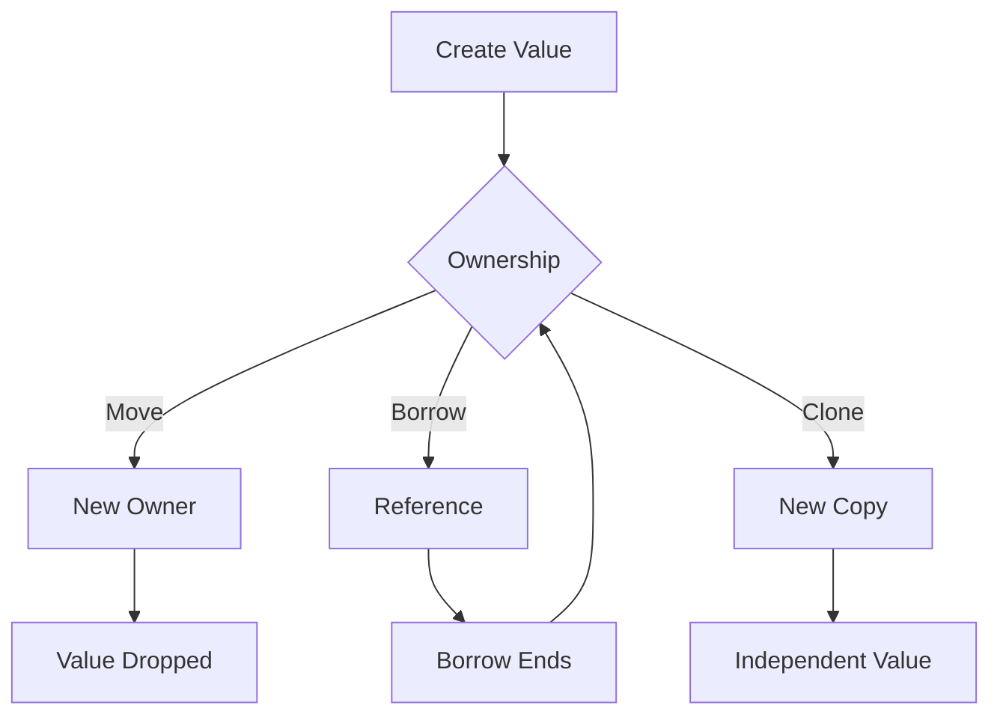
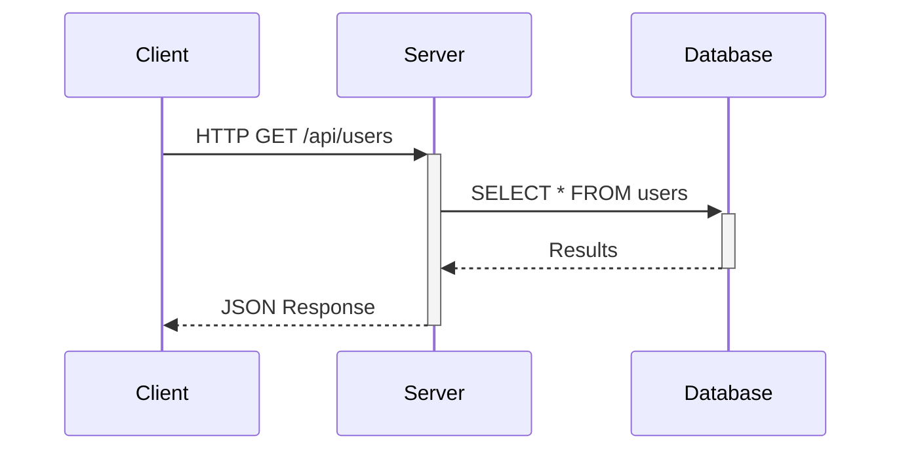
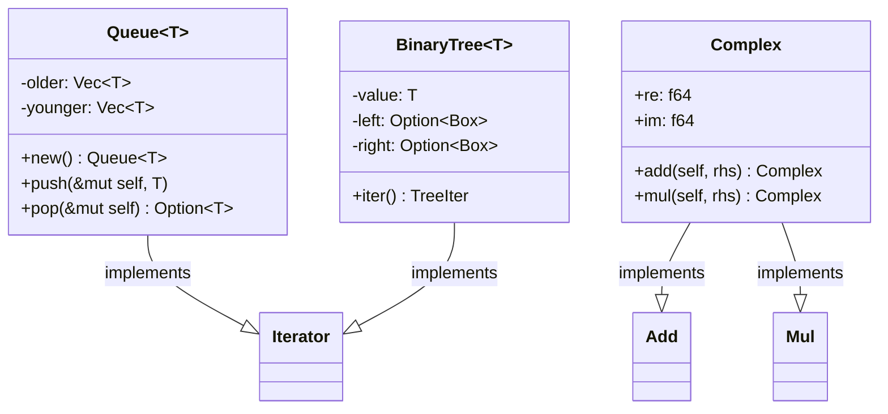
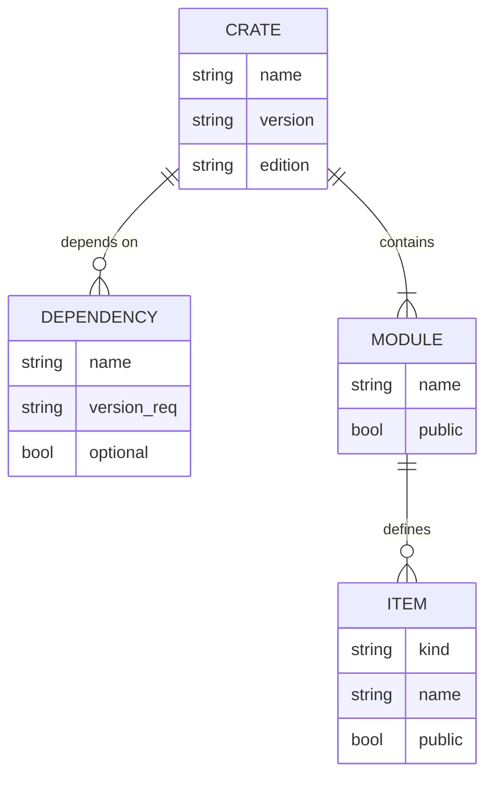
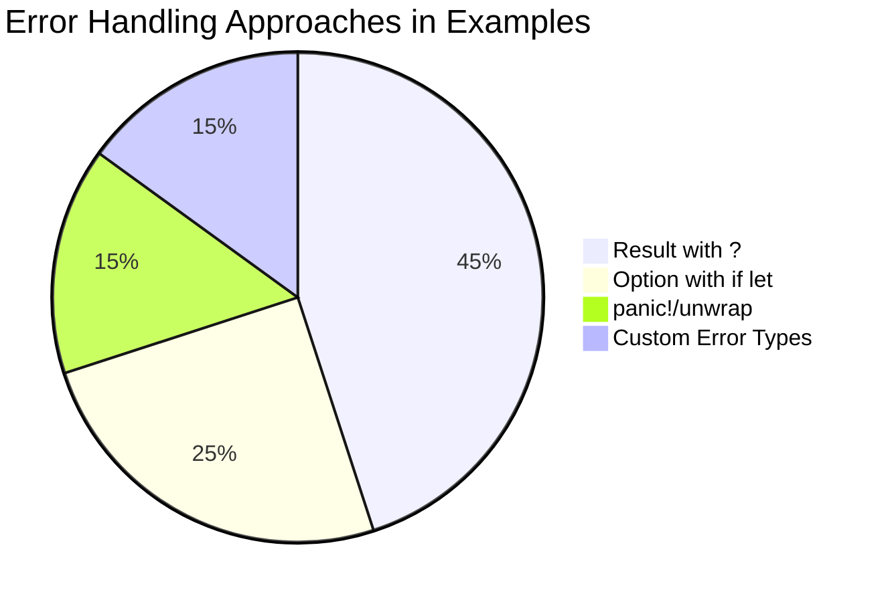
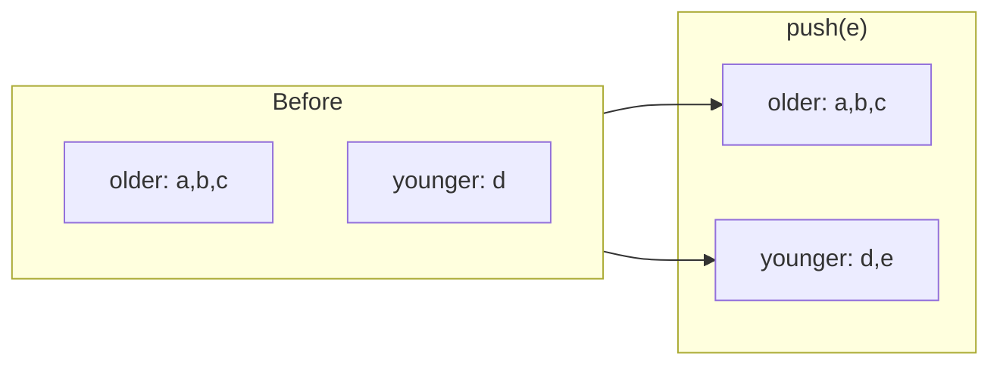
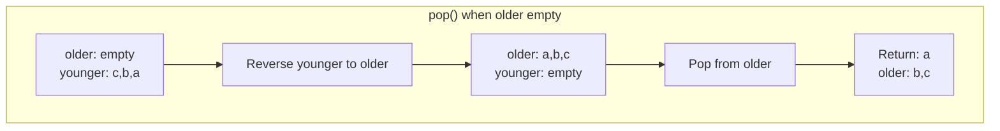

# Appendix A: Extension Showcase

This appendix demonstrates the mdbook extensions used in this book. Use this page to verify that all extensions are rendering correctly.

---

## KaTeX (LaTeX Math Rendering)

KaTeX renders mathematical notation using LaTeX syntax.

### Inline Math

The time complexity of the two-stack queue is amortized $O(1)$ per operation. Each element is moved at most twice: once onto `younger`, once onto `older`.

The golden ratio is $\phi = \frac{1 + \sqrt{5}}{2} \approx 1.618$.

### Display Math (Block)

The amortized analysis of `Queue::pop`:

$$
\text{Amortized Cost} = \frac{\text{Total Operations}}{\text{Number of Pops}} = \frac{n + n}{n} = O(1)
$$

### Big O Notation

Common complexity classes in Rust standard library:

| Operation | Complexity |
|-----------|------------|
| `Vec::push` | $O(1)$ amortized |
| `Vec::pop` | $O(1)$ |
| `HashMap::get` | $O(1)$ expected |
| `BTreeMap::get` | $O(\log n)$ |
| `Vec::sort` | $O(n \log n)$ |

### Ownership Transfer Formula

When a value moves from one owner to another:

$$
\text{let } y = x; \implies \text{owner}(x) \xrightarrow{\text{move}} \text{owner}(y)
$$

After the move, $x$ is no longer accessible (compile-time enforcement).

### Trait Bound Notation

A generic function with trait bounds can be expressed as:

$$
\forall T : \text{Clone} + \text{Debug}, \quad f: T \rightarrow T
$$

Which in Rust is written as:

```rust
fn f<T: Clone + Debug>(x: T) -> T
```

---

## Mermaid Diagrams

Mermaid renders diagrams from text descriptions.

### Flowchart: Ownership Flow



### Sequence Diagram: HTTP Request



### State Diagram: Future Lifecycle

```mermaid
stateDiagram-v2
    [*] --> Created: async block
    Created --> Pending: .await
    Pending --> Pending: Poll::Pending
    Pending --> Ready: Poll::Ready
    Ready --> [*]: Value returned
```

### Class Diagram: Pattern Types



### Gantt Chart: Build Pipeline

```mermaid
gantt
    title Rust Build Pipeline
    dateFormat X
    axisFormat %s

    section Compile
    Parse          :a1, 0, 2
    Type Check     :a2, after a1, 3
    Borrow Check   :a3, after a2, 2
    Codegen        :a4, after a3, 4

    section Link
    Link           :b1, after a4, 2

    section Test
    Unit Tests     :c1, after b1, 3
    Integration    :c2, after c1, 4
```



### Entity Relationship: Crate Dependencies



### Pie Chart: Error Handling Distribution



---

## Combined Example: Algorithm Visualization

Here's the two-stack queue algorithm visualized with both math and diagrams:

### The Invariant

The queue maintains this invariant:

$$
\text{Queue} = \text{older} \circ \text{reverse}(\text{younger})
$$

Where $\circ$ denotes concatenation.

### Push Operation: $O(1)$



### Pop Operation: Amortized $O(1)$



The amortized cost is $O(1)$ because each element is moved at most twice:
1. Once when pushed to `younger`: $O(1)$
2. Once when reversed to `older`: $O(1)$ amortized

Total work per element: $O(1) + O(1) = O(1)$ amortized.

---

## Verifying Extensions Work

If this page renders correctly, you should see:

- [ ] **Inline math**: $\phi$, $O(1)$, fractions like $\frac{a}{b}$
- [ ] **Display math**: Centered equations with proper formatting
- [ ] **Flowcharts**: Boxes with arrows showing ownership flow
- [ ] **Sequence diagrams**: Actors with message arrows
- [ ] **State diagrams**: States with transitions
- [ ] **Class diagrams**: UML-style class representations
- [ ] **Gantt charts**: Timeline bars
- [ ] **ER diagrams**: Entities with relationships
- [ ] **Pie charts**: Colored segments with labels

If any of these don't render, check your `book.toml` configuration and ensure the preprocessors are installed:

```bash
# Install KaTeX preprocessor
cargo install mdbook-katex

# Install Mermaid preprocessor
cargo install mdbook-mermaid

# Initialize Mermaid assets
mdbook-mermaid install /path/to/book
```

---

## Extension Configuration Reference

Current `book.toml` configuration:

```toml
[preprocessor.mermaid]
command = "mdbook-mermaid"

[preprocessor.katex]
after = ["mermaid"]
```

### Additional Options

```toml
# KaTeX options
[preprocessor.katex]
after = ["mermaid"]
# Enable copy-tex extension (click to copy LaTeX)
copy-tex = true
# Throw on error vs render error message
throw-on-error = false

# Mermaid options
[output.html]
additional-js = ["mermaid.min.js", "mermaid-init.js"]
```
