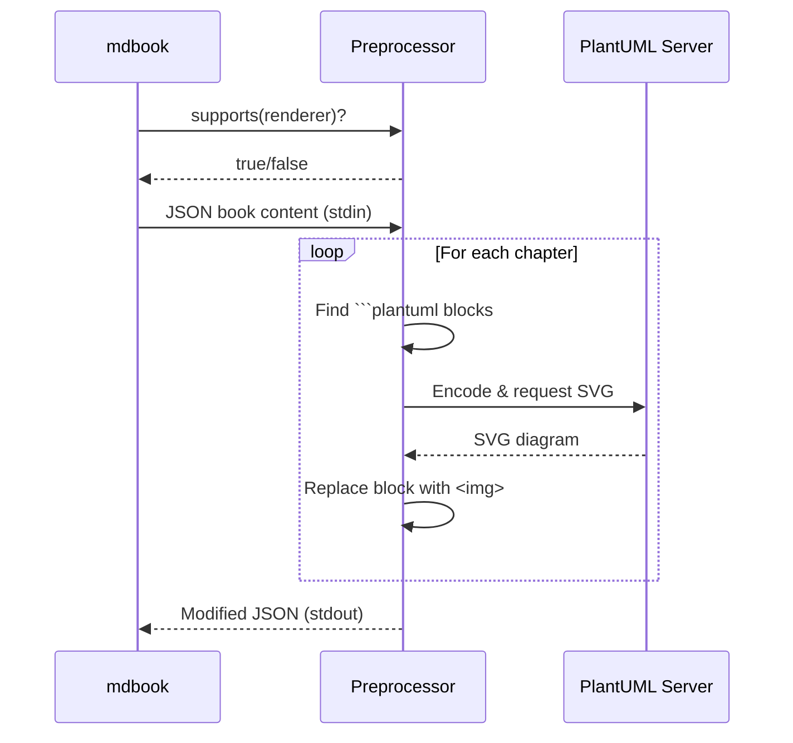
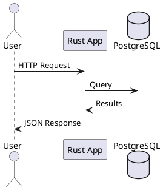
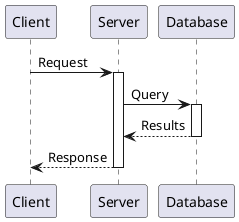
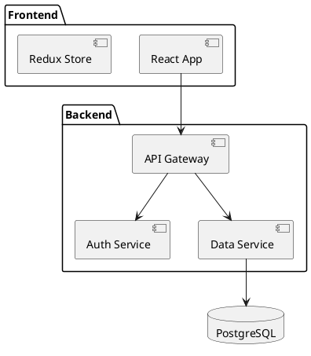
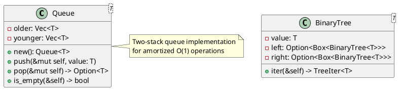
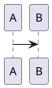

# Appendix: Authoring mdbook Plugins

*Building your own preprocessors to extend mdbook's capabilities*

This appendix demonstrates how to create an mdbook preprocessor plugin by building a complete **PlantUML preprocessor** from scratch. PlantUML is a text-based diagram tool that complements Mermaid with additional diagram types like sequence diagrams, component diagrams, and more.

---

## Understanding mdbook's Plugin Architecture

mdbook supports two types of plugins:

1. **Preprocessors** - Transform markdown content before rendering
2. **Backends** - Generate alternative output formats (PDF, EPUB, etc.)

Both communicate with mdbook via **JSON over stdin/stdout**, making them language-agnostic. We'll implement our PlantUML preprocessor in Rust.

### The Plugin Lifecycle



---

## Project Setup

Create a new Rust project for the preprocessor:

```bash
cargo new mdbook-plantuml --bin
cd mdbook-plantuml
```

Add dependencies to `Cargo.toml`:

```toml
[package]
name = "mdbook-plantuml"
version = "0.1.0"
edition = "2021"
description = "An mdbook preprocessor for PlantUML diagrams"

[dependencies]
mdbook = "0.4"
serde = { version = "1.0", features = ["derive"] }
serde_json = "1.0"
clap = { version = "4.0", features = ["derive"] }
deflate = "1.0"
base64 = "0.21"
ureq = "2.9"
anyhow = "1.0"
```

---

## The Complete Implementation

### Main Entry Point

The preprocessor must handle two commands:
- `supports <renderer>` - Check if we support the target renderer
- (no args) - Process the book via stdin/stdout

```rust
// src/main.rs
use anyhow::{Context, Result};
use clap::{Parser, Subcommand};
use mdbook::book::Book;
use mdbook::preprocess::{CmdPreprocessor, Preprocessor, PreprocessorContext};
use std::io;
use std::process;

mod plantuml;
use plantuml::PlantUmlPreprocessor;

#[derive(Parser)]
#[command(name = "mdbook-plantuml")]
#[command(about = "An mdbook preprocessor for PlantUML diagrams")]
struct Cli {
    #[command(subcommand)]
    command: Option<Commands>,
}

#[derive(Subcommand)]
enum Commands {
    /// Check if this preprocessor supports the given renderer
    Supports { renderer: String },
}

fn main() -> Result<()> {
    let cli = Cli::parse();
    let preprocessor = PlantUmlPreprocessor::new();

    match cli.command {
        Some(Commands::Supports { renderer }) => {
            // We support HTML output
            if preprocessor.supports_renderer(&renderer) {
                process::exit(0);
            } else {
                process::exit(1);
            }
        }
        None => {
            // Process the book
            handle_preprocessing(&preprocessor)
        }
    }
}

fn handle_preprocessing(preprocessor: &PlantUmlPreprocessor) -> Result<()> {
    let (ctx, book) = CmdPreprocessor::parse_input(io::stdin())
        .context("Failed to parse mdbook input")?;

    let processed = preprocessor.run(&ctx, book)
        .context("Failed to process book")?;

    serde_json::to_writer(io::stdout(), &processed)
        .context("Failed to write processed book")?;

    Ok(())
}
```

### The Preprocessor Implementation

```rust
// src/plantuml.rs
use anyhow::{Context, Result};
use base64::{engine::general_purpose::STANDARD, Engine};
use deflate::deflate_bytes;
use mdbook::book::{Book, BookItem, Chapter};
use mdbook::preprocess::{Preprocessor, PreprocessorContext};
use std::borrow::Cow;

/// PlantUML preprocessor that converts ```plantuml code blocks to SVG images
pub struct PlantUmlPreprocessor {
    server_url: String,
}

impl PlantUmlPreprocessor {
    pub fn new() -> Self {
        Self {
            server_url: "https://www.plantuml.com/plantuml/svg".to_string(),
        }
    }

    /// Encode PlantUML source using the PlantUML encoding scheme
    fn encode_plantuml(source: &str) -> String {
        // PlantUML uses a special base64 variant
        const PLANTUML_ALPHABET: &[u8; 64] =
            b"0123456789ABCDEFGHIJKLMNOPQRSTUVWXYZabcdefghijklmnopqrstuvwxyz-_";

        let compressed = deflate_bytes(source.as_bytes());

        let mut encoded = String::new();
        let mut i = 0;

        while i < compressed.len() {
            let b1 = compressed[i] as usize;
            let b2 = compressed.get(i + 1).copied().unwrap_or(0) as usize;
            let b3 = compressed.get(i + 2).copied().unwrap_or(0) as usize;

            encoded.push(PLANTUML_ALPHABET[b1 >> 2] as char);
            encoded.push(PLANTUML_ALPHABET[((b1 & 0x3) << 4) | (b2 >> 4)] as char);
            encoded.push(PLANTUML_ALPHABET[((b2 & 0xF) << 2) | (b3 >> 6)] as char);
            encoded.push(PLANTUML_ALPHABET[b3 & 0x3F] as char);

            i += 3;
        }

        encoded
    }

    /// Fetch SVG from PlantUML server
    fn fetch_svg(&self, source: &str) -> Result<String> {
        let encoded = Self::encode_plantuml(source);
        let url = format!("{}/{}", self.server_url, encoded);

        let response = ureq::get(&url)
            .call()
            .context("Failed to fetch from PlantUML server")?;

        response.into_string()
            .context("Failed to read PlantUML response")
    }

    /// Process a single chapter, replacing ```plantuml blocks
    fn process_chapter(&self, chapter: &mut Chapter) -> Result<()> {
        let content = &chapter.content;
        let mut new_content = String::with_capacity(content.len());
        let mut last_end = 0;

        // Find all ```plantuml ... ``` blocks
        let mut search_start = 0;
        while let Some(start) = content[search_start..].find("```plantuml") {
            let abs_start = search_start + start;
            let code_start = abs_start + "```plantuml".len();

            // Skip optional newline after ```plantuml
            let code_start = if content[code_start..].starts_with('\n') {
                code_start + 1
            } else {
                code_start
            };

            // Find closing ```
            if let Some(end_offset) = content[code_start..].find("```") {
                let code_end = code_start + end_offset;
                let block_end = code_end + 3;

                let plantuml_source = &content[code_start..code_end];

                // Append content before this block
                new_content.push_str(&content[last_end..abs_start]);

                // Fetch and embed SVG
                match self.fetch_svg(plantuml_source) {
                    Ok(svg) => {
                        new_content.push_str("<div class=\"plantuml-diagram\">\n");
                        new_content.push_str(&svg);
                        new_content.push_str("\n</div>\n");
                    }
                    Err(e) => {
                        eprintln!("Warning: Failed to render PlantUML: {}", e);
                        // Keep original block on error
                        new_content.push_str(&content[abs_start..block_end]);
                    }
                }

                last_end = block_end;
                search_start = block_end;
            } else {
                // No closing ```, skip
                search_start = code_start;
            }
        }

        // Append remaining content
        new_content.push_str(&content[last_end..]);
        chapter.content = new_content;

        Ok(())
    }
}

impl Preprocessor for PlantUmlPreprocessor {
    fn name(&self) -> &str {
        "plantuml"
    }

    fn supports_renderer(&self, renderer: &str) -> bool {
        renderer == "html"
    }

    fn run(&self, _ctx: &PreprocessorContext, mut book: Book) -> Result<Book, mdbook::errors::Error> {
        book.for_each_mut(|item| {
            if let BookItem::Chapter(chapter) = item {
                if let Err(e) = self.process_chapter(chapter) {
                    eprintln!("Error processing chapter '{}': {}", chapter.name, e);
                }
            }
        });

        Ok(book)
    }
}
```

---

## Configuration

Add the preprocessor to your `book.toml`:

```toml
[preprocessor.plantuml]
command = "mdbook-plantuml"
# Optional: use a local PlantUML server
# server = "http://localhost:8080/plantuml/svg"
```

### Optional: Local PlantUML Server

For faster builds and offline use, run PlantUML locally:

```bash
docker run -d -p 8080:8080 plantuml/plantuml-server:jetty
```

Then configure the preprocessor:

```toml
[preprocessor.plantuml]
command = "mdbook-plantuml"
server = "http://localhost:8080/svg"
```

---

## Usage in Markdown

Once installed, use PlantUML in your markdown files:

~~~markdown

~~~

### Diagram Types Supported

#### Sequence Diagrams



#### Component Diagrams

~~~markdown

~~~

#### Class Diagrams (for Rust structs)

~~~markdown

~~~

---

## Testing the Preprocessor

Create integration tests:

```rust
// tests/integration.rs
use mdbook::book::{Book, Chapter};
use mdbook::preprocess::{Preprocessor, PreprocessorContext};
use mdbook_plantuml::PlantUmlPreprocessor;

#[test]
fn test_supports_html() {
    let preprocessor = PlantUmlPreprocessor::new();
    assert!(preprocessor.supports_renderer("html"));
    assert!(!preprocessor.supports_renderer("pdf"));
}

#[test]
fn test_plantuml_block_detection() {
    let input = r#"
# Test Chapter

Some text.



More text.
"#;

    // Verify block is detected and processed
    // (requires network for full test)
}
```

Run tests:

```bash
cargo test
```

---

## Advanced Features

### Caching Diagrams

Add caching to avoid re-rendering unchanged diagrams:

```rust
use std::collections::HashMap;
use std::fs;
use std::path::PathBuf;
use sha2::{Sha256, Digest};

struct CachedPlantUmlPreprocessor {
    inner: PlantUmlPreprocessor,
    cache_dir: PathBuf,
}

impl CachedPlantUmlPreprocessor {
    fn get_cached_or_fetch(&self, source: &str) -> Result<String> {
        let hash = format!("{:x}", Sha256::digest(source.as_bytes()));
        let cache_path = self.cache_dir.join(format!("{}.svg", hash));

        if cache_path.exists() {
            return fs::read_to_string(&cache_path)
                .context("Failed to read cached SVG");
        }

        let svg = self.inner.fetch_svg(source)?;
        fs::create_dir_all(&self.cache_dir)?;
        fs::write(&cache_path, &svg)?;

        Ok(svg)
    }
}
```

### Error Diagrams

Generate helpful error diagrams when PlantUML fails:

```rust
fn error_svg(message: &str) -> String {
    format!(r#"
<svg xmlns="http://www.w3.org/2000/svg" width="400" height="100">
  <rect width="100%" height="100%" fill="#ffcccc" rx="5"/>
  <text x="10" y="30" font-family="monospace" font-size="14" fill="#cc0000">
    PlantUML Error:
  </text>
  <text x="10" y="60" font-family="monospace" font-size="12" fill="#333">
    {}
  </text>
</svg>
"#, html_escape(message))
}
```

---

## Publishing Your Plugin

### To crates.io

```bash
# Update Cargo.toml with metadata
cargo publish --dry-run
cargo publish
```

### Installation

Users can then install with:

```bash
cargo install mdbook-plantuml
```

---

## Comparison: Mermaid vs PlantUML

| Feature | Mermaid | PlantUML |
|---------|---------|----------|
| **Rendering** | Client-side JS | Server-side |
| **Syntax** | Custom | UML-based |
| **Offline** | Yes | Requires server |
| **Diagram types** | 10+ | 15+ |
| **Rust integration** | mdbook-mermaid | Custom (this chapter) |
| **Best for** | Quick diagrams | Complex UML |

Use **Mermaid** for:
- Flowcharts, simple sequences
- Client-side rendering
- No external dependencies

Use **PlantUML** for:
- Complex UML diagrams
- Component/deployment diagrams
- When you need more diagram types

---

## Pattern Connection

This plugin authoring approach demonstrates several patterns from this book:

- **[42. FUNCTION TAKING ASREF PATH](./patterns/42-function-taking-asref-path.md)** - Flexible path handling in cache code
- **[40. FUNCTION RETURNING RESULT](./patterns/40-function-returning-result.md)** - Error propagation throughout
- **[26. IMPL BLOCK WITH TRAIT](./patterns/26-impl-block-with-trait.md)** - Implementing the `Preprocessor` trait
- **[35. METHOD CONSUMING SELF](./patterns/35-method-consuming-self.md)** - Builder patterns for configuration

---

## Exercises

1. **Add configuration support**: Read `server` from `book.toml` config
2. **Implement caching**: Store rendered SVGs to avoid re-fetching
3. **Add theme support**: Generate light/dark mode diagrams
4. **Create a backend**: Output PlantUML source to a separate file for documentation
5. **Support other formats**: Add PNG output option via PlantUML server

---

## Further Reading

- [mdbook Preprocessor Documentation](https://rust-lang.github.io/mdBook/for_developers/preprocessors.html)
- [PlantUML Language Reference](https://plantuml.com/guide)
- [mdbook Source Code](https://github.com/rust-lang/mdBook)
- [Existing mdbook Preprocessors](https://github.com/rust-lang/mdBook/wiki/Third-party-plugins)
